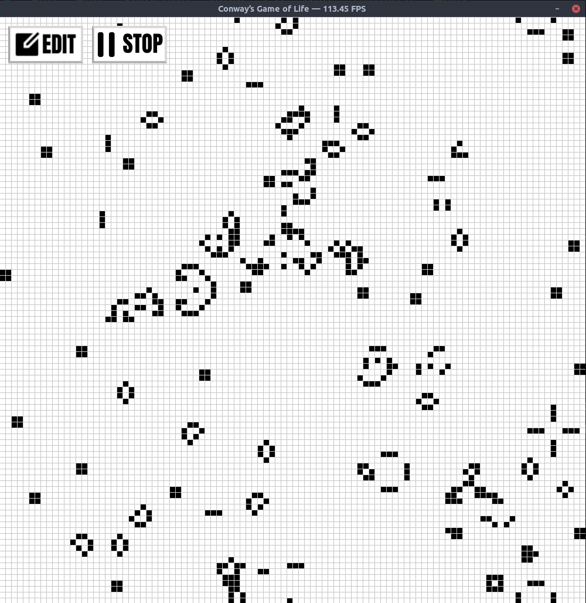

# Game of Life

Small implementation of **Conway's Game of Life** in Python, using **Tkinter** for rendering and **NumPy** to compute each generation.

## What is Game of Life?

Conway's Game of Life is a cellular automaton.
It simulates the evolution of a grid of cells, where each cell lives, dies, or is born depending on the state of its neighbors.
Despite its very simple rules, it can produce complex and surprising patterns.

## Preview



## Run the project

```bash
pip install numpy
python main.py
```

## Options

```bash
python main.py --size 100 --window-size 1000
```

- `--size`: grid size
- `--window-size`: window size

## Controls

- `Left click`: advance by one generation
- `Right click`: enable or disable edit mode
- `Space`: start / stop auto-run
- `r`: generate a random grid

## Edit mode

When edit mode is enabled, left click lets you add live cells directly to the grid.
